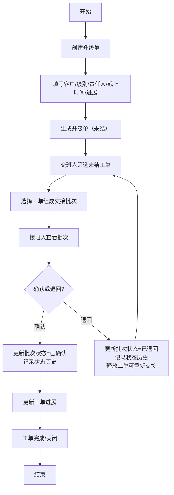

## 1. 产品概述

本地客服升级值班交接系统，用于管理客户升级工单的创建、交接和状态追踪。解决客服团队交接班时未结事项遗漏、责任不清晰、状态历史不可追溯的问题。

- 目标用户：客服团队（普通客服、交班人、接班人）
- 核心价值：确保升级工单在交接班过程中无缝衔接，所有状态变更可追溯，高危工单有严格的权限控制

## 2. 核心功能

### 2.1 用户角色

| 角色 | 注册方式 | 核心权限 |
|------|----------|----------|
| 普通客服 | 示例账号预设 | 创建升级单、查看看板、按条件筛选、导出数据 |
| 交班人 | 角色切换 | 创建交接批次、查看未结工单、查看交接历史 |
| 接班人 | 角色切换 | 确认/退回交接批次、查看批次详情、更新工单进展 |

### 2.2 功能模块

1. **系统看板**：工单统计、严重级别分布、状态概览、操作日志
2. **升级单管理**：创建升级单、编辑进展、查看详情、状态筛选、严重级别过滤
3. **交接批次管理**：创建交接批次、批次详情、确认/退回交接
4. **数据导出**：CSV/JSON 格式导出工单和交接记录

### 2.3 页面详情

| 页面名称 | 模块名称 | 功能描述 |
|----------|----------|----------|
| 系统看板 | 统计卡片 | 展示待处理、处理中、已关闭、逾期工单数量 |
| 系统看板 | 操作日志 | 展示所有状态变更历史记录 |
| 升级单列表 | 筛选区域 | 按状态、严重级别、责任人、时间范围过滤 |
| 升级单列表 | 工单列表 | 展示工单详情，支持编辑进展 |
| 创建升级单 | 表单区域 | 填写客户、严重级别、责任人、截止时间、进展描述 |
| 交接批次列表 | 批次列表 | 展示所有交接批次及其状态 |
| 交接批次详情 | 批次信息 | 展示批次内含工单、交接人、接班人、交接时间 |
| 角色切换 | 角色选择 | 切换当前登录角色以测试不同权限 |

## 3. 核心流程

**主流程描述**：
1. 普通客服使用示例账号登录系统
2. 创建客户升级单，填写客户信息、严重级别、责任人、截止时间和进展描述
3. 交班人筛选所有未结工单，选择需要交接的工单组成交接批次
4. 接班人查看待确认的交接批次，确认接收或退回
5. 确认或退回操作记录状态历史，更新工单和批次状态

**失败路径覆盖**：
1. 普通客服尝试关闭逾期高危单 → 拒绝并给出明确错误
2. 同一未结工单被加入两个开放交接批次 → 阻止并给出明确错误
3. 重复确认同一交接批次 → 拒绝并给出明确错误，不重复写入历史

## 4. 用户界面设计

### 4.1 设计风格

- **主色调**：深蓝 (#1e3a5f) 搭配浅灰背景，体现专业稳重
- **辅助色**：
  - 高危级别：红色 (#e74c3c)
  - 中危级别：橙色 (#f39c12)
  - 低危级别：绿色 (#27ae60)
  - 待确认：蓝色 (#3498db)
- **按钮风格**：直角矩形，边框2px，悬停时有背景色过渡动画
- **字体**：标题使用思源宋体 Bold，正文使用思源黑体 Regular
- **布局风格**：左侧导航栏 + 右侧内容区，卡片式布局
- **图标风格**：Font Awesome 线性图标

### 4.2 页面设计概述

| 页面名称 | 模块名称 | UI 元素 |
|----------|----------|----------|
| 系统看板 | 统计卡片 | 渐变背景、数字动画、悬浮阴影效果 |
| 系统看板 | 操作日志 | 时间轴布局、状态标签、滚动加载 |
| 升级单列表 | 筛选区域 | 下拉选择器、日期选择器、清除按钮 |
| 升级单列表 | 工单列表 | 表格布局、行悬停高亮、严重级别色标 |
| 创建升级单 | 表单区域 | 左侧标签、右侧输入、必填星号、表单验证 |
| 交接批次详情 | 批次信息 | 两栏布局，左侧批次信息，右侧工单列表 |

### 4.3 响应式设计

- 桌面端优先设计（最小宽度 1280px）
- 平板端：左侧导航折叠为图标菜单
- 移动端：底部导航栏，卡片堆叠布局
- 表格支持横向滚动

### 4.4 动效设计

- 页面加载：元素从下往上淡入，stagger 延迟 100ms
- 状态变更：数字跳动动画、状态标签颜色渐变
- 按钮交互：悬停时背景色过渡 200ms，点击时缩放 0.98
- 表单验证：错误信息抖动动画
