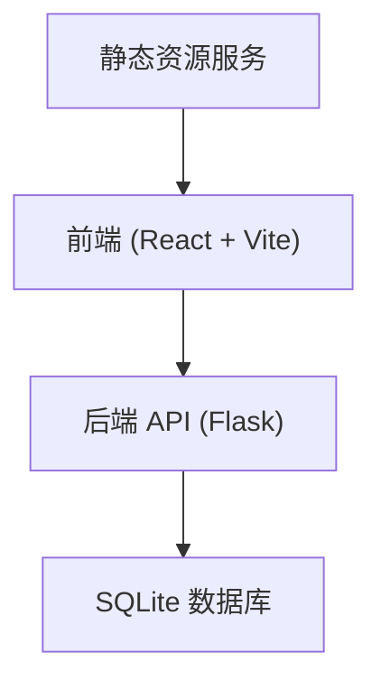
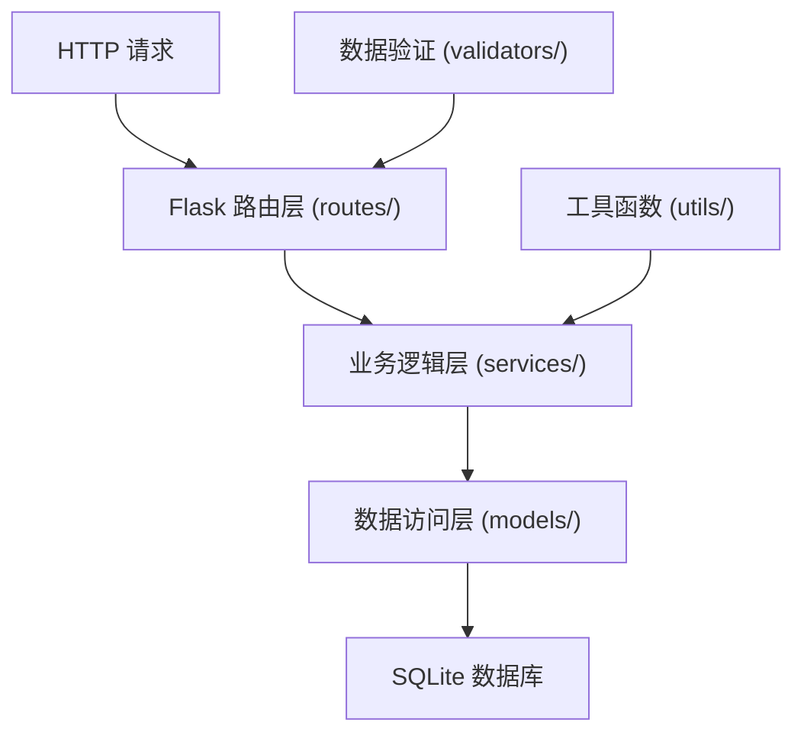
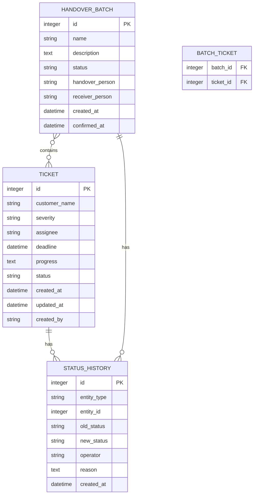

## 1. 架构设计



## 2. 技术描述

- **前端**：React@18 + TypeScript + tailwindcss@3 + vite
- **初始化工具**：npm create vite@latest
- **后端**：Flask@3 + Flask-CORS + Flask-SQLAlchemy
- **数据库**：SQLite（本地文件存储，无需额外服务）
- **状态管理**：React Context API
- **UI 组件**：自定义组件 + Font Awesome 图标
- **HTTP 客户端**：axios

## 3. 路由定义

| 路由 | 页面 | 用途 |
|------|------|------|
| /dashboard | 系统看板 | 工单统计、操作日志 |
| /tickets | 升级单列表 | 查看和筛选所有升级单 |
| /tickets/create | 创建升级单 | 新建客户升级工单 |
| /tickets/:id | 升级单详情 | 查看和编辑单个升级单 |
| /batches | 交接批次列表 | 查看所有交接批次 |
| /batches/create | 创建交接批次 | 选择未结工单组成交接批次 |
| /batches/:id | 交接批次详情 | 查看批次详情、确认/退回交接 |

## 4. API 定义

### 4.1 通用响应格式

```typescript
interface ApiResponse<T> {
  success: boolean;
  data?: T;
  error?: string;
  message?: string;
}
```

### 4.2 升级单 API

```typescript
// 升级单类型
interface Ticket {
  id: number;
  customer_name: string;
  severity: 'low' | 'medium' | 'high' | 'critical';
  assignee: string;
  deadline: string;
  progress: string;
  status: 'open' | 'in_progress' | 'closed' | 'overdue';
  created_at: string;
  updated_at: string;
  created_by: string;
}

// 获取升级单列表
GET /api/tickets?status=&severity=&assignee=&page=&page_size=
Response: { items: Ticket[], total: number }

// 获取单个升级单
GET /api/tickets/:id
Response: Ticket

// 创建升级单
POST /api/tickets
Body: { customer_name, severity, assignee, deadline, progress }
Response: Ticket

// 更新升级单
PUT /api/tickets/:id
Body: { progress?, status?, assignee?, deadline? }
Response: Ticket

// 关闭升级单
POST /api/tickets/:id/close
Response: Ticket
```

### 4.3 交接批次 API

```typescript
// 交接批次类型
interface HandoverBatch {
  id: number;
  name: string;
  description: string;
  status: 'pending' | 'confirmed' | 'returned';
  handover_person: string;
  receiver_person: string | null;
  created_at: string;
  confirmed_at: string | null;
  ticket_ids: number[];
}

// 获取交接批次列表
GET /api/batches?status=
Response: HandoverBatch[]

// 获取单个批次详情
GET /api/batches/:id
Response: HandoverBatch & { tickets: Ticket[] }

// 创建交接批次
POST /api/batches
Body: { name, description, ticket_ids, handover_person }
Response: HandoverBatch

// 确认交接
POST /api/batches/:id/confirm
Body: { receiver_person }
Response: HandoverBatch

// 退回交接
POST /api/batches/:id/return
Body: { receiver_person, reason }
Response: HandoverBatch
```

### 4.4 状态历史 API

```typescript
interface StatusHistory {
  id: number;
  entity_type: 'ticket' | 'batch';
  entity_id: number;
  old_status: string | null;
  new_status: string;
  operator: string;
  reason: string | null;
  created_at: string;
}

// 获取操作日志
GET /api/history?entity_type=&entity_id=&limit=
Response: StatusHistory[]
```

### 4.5 导出 API

```typescript
// 导出升级单
GET /api/export/tickets?format=csv|json&status=&severity=
Response: 文件下载

// 导出交接批次
GET /api/export/batches?format=csv|json
Response: 文件下载
```

### 4.6 角色 API

```typescript
// 获取当前角色
GET /api/current-role
Response: { role: 'cs' | 'handover' | 'receiver', username: string }

// 切换角色
POST /api/switch-role
Body: { role, username }
Response: { role: string, username: string }

// 获取可用角色列表
GET /api/roles
Response: [{ role: string, name: string, permissions: string[] }]
```

## 5. 服务器架构图



## 6. 数据模型

### 6.1 ER 图



### 6.2 DDL 语句

```sql
-- 升级单表
CREATE TABLE IF NOT EXISTS ticket (
    id INTEGER PRIMARY KEY AUTOINCREMENT,
    customer_name VARCHAR(200) NOT NULL,
    severity VARCHAR(20) NOT NULL CHECK (severity IN ('low', 'medium', 'high', 'critical')),
    assignee VARCHAR(100) NOT NULL,
    deadline DATETIME NOT NULL,
    progress TEXT,
    status VARCHAR(20) NOT NULL DEFAULT 'open' CHECK (status IN ('open', 'in_progress', 'closed', 'overdue')),
    created_at DATETIME DEFAULT CURRENT_TIMESTAMP,
    updated_at DATETIME DEFAULT CURRENT_TIMESTAMP,
    created_by VARCHAR(100) NOT NULL
);

CREATE INDEX idx_ticket_status ON ticket(status);
CREATE INDEX idx_ticket_severity ON ticket(severity);
CREATE INDEX idx_ticket_assignee ON ticket(assignee);
CREATE INDEX idx_ticket_deadline ON ticket(deadline);

-- 交接批次表
CREATE TABLE IF NOT EXISTS handover_batch (
    id INTEGER PRIMARY KEY AUTOINCREMENT,
    name VARCHAR(200) NOT NULL,
    description TEXT,
    status VARCHAR(20) NOT NULL DEFAULT 'pending' CHECK (status IN ('pending', 'confirmed', 'returned')),
    handover_person VARCHAR(100) NOT NULL,
    receiver_person VARCHAR(100),
    created_at DATETIME DEFAULT CURRENT_TIMESTAMP,
    confirmed_at DATETIME
);

CREATE INDEX idx_batch_status ON handover_batch(status);
CREATE INDEX idx_batch_handover_person ON handover_batch(handover_person);

-- 批次工单关联表
CREATE TABLE IF NOT EXISTS batch_ticket (
    batch_id INTEGER NOT NULL,
    ticket_id INTEGER NOT NULL,
    PRIMARY KEY (batch_id, ticket_id),
    FOREIGN KEY (batch_id) REFERENCES handover_batch(id) ON DELETE CASCADE,
    FOREIGN KEY (ticket_id) REFERENCES ticket(id) ON DELETE CASCADE
);

CREATE INDEX idx_batch_ticket_ticket_id ON batch_ticket(ticket_id);

-- 状态历史表
CREATE TABLE IF NOT EXISTS status_history (
    id INTEGER PRIMARY KEY AUTOINCREMENT,
    entity_type VARCHAR(20) NOT NULL CHECK (entity_type IN ('ticket', 'batch')),
    entity_id INTEGER NOT NULL,
    old_status VARCHAR(20),
    new_status VARCHAR(20) NOT NULL,
    operator VARCHAR(100) NOT NULL,
    reason TEXT,
    created_at DATETIME DEFAULT CURRENT_TIMESTAMP
);

CREATE INDEX idx_history_entity ON status_history(entity_type, entity_id);
CREATE INDEX idx_history_created_at ON status_history(created_at);

-- 示例账号数据
INSERT OR IGNORE INTO ticket (customer_name, severity, assignee, deadline, progress, status, created_by)
VALUES
    ('示例客户A', 'high', '张三', DATETIME('now', '+2 days'), '已联系客户，等待反馈', 'open', 'cs_demo'),
    ('示例客户B', 'critical', '李四', DATETIME('now', '-1 days'), '紧急问题正在排查', 'overdue', 'cs_demo'),
    ('示例客户C', 'medium', '王五', DATETIME('now', '+5 days'), '初步方案已确定', 'in_progress', 'cs_demo');
```
